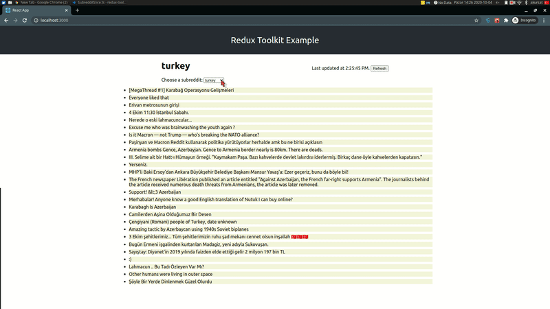

# redux-toolkit-example

Lists selected subreddit posts on Reddit.com using with redux-toolkit.

#### Pre Requisite

You must have yarn installed before setting up this project.

- **yarn**

#### Running

To install dependencies:

- `yarn install`

To run the dev environment:

- `yarn run dev`

To build:

- `yarn run build`
